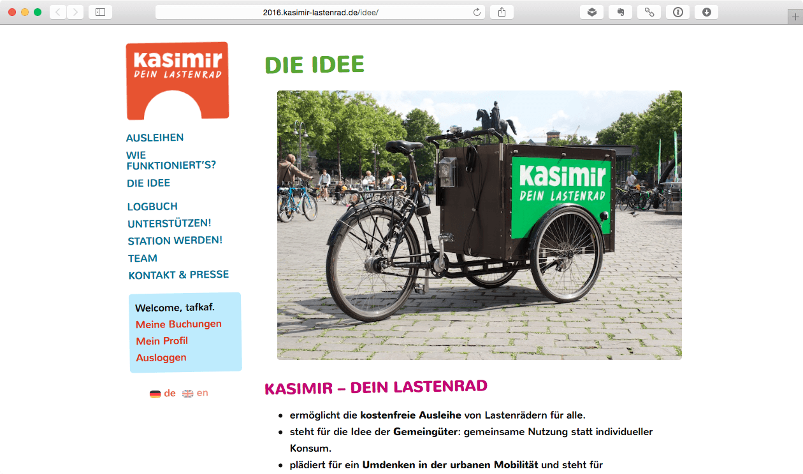

# KASIMIR WordPress Theme 

Colorful WordPress Theme based on [wd_s](https://github.com/WebDevStudios/wd_s).

Developed for http://www.kasimir-lastenrad.de, optimized for [Commons Booking](http://www.wielebenwir.de/projekte/commons-booking) Wordpress plugin. 

Florian Egermann / wielebenwir e.V.

Supported languages: DE, EN 

License: GNU General Public License v2 or later

License URI: http://www.gnu.org/licenses/gpl-2.0.html